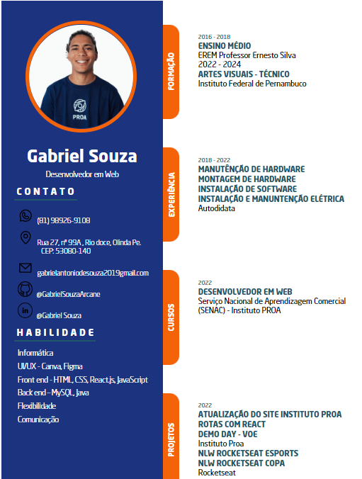

<h1 align="center"> CURRÍCULO </h1>

 

  

## 🚀 Tecnologias

Esse projeto foi desenvolvido com as seguintes tecnologias:

- HTML e CSS
- Git e GitHub

## 💻 Projeto

Criação de um currículo em html

---
